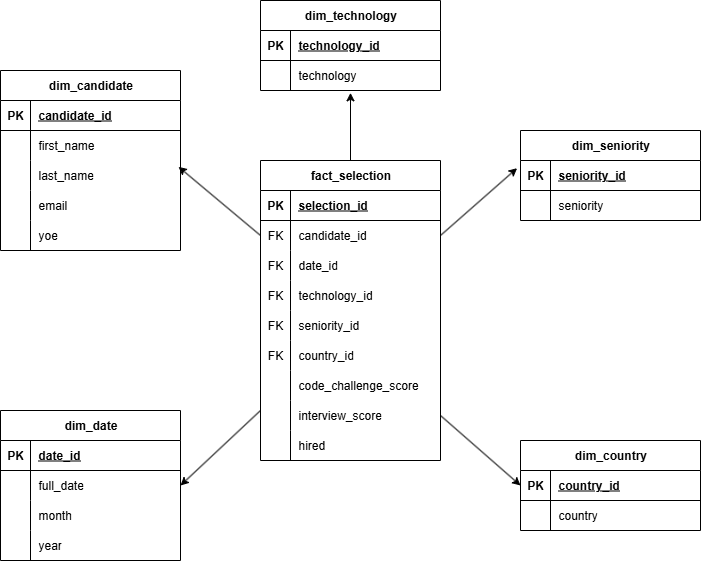

# workshop-1-ETL

## Libraries used

| Library                    | Purpose                                                           |
| -------------------------- | ----------------------------------------------------------------- |
| **pandas**                 | Data extraction, cleaning, transformation, and table creation     |
| **mysql-connector-python** | Connection and queries to the MySQL Data Warehouse                |
| **sqlalchemy**             | Engine creation and SQL execution with pandas                     |
| **plotly**                 | Data visualizations (bar charts, line charts)                     |
| **dash**                   | Web app framework to build the interactive dashboard              |
| **dash\_table**            | Display tables (like Top Countries by Hire Rate) in the dashboard |

## Star Schema

A **star schema data warehouse** was designed to analyze the **candidate selection process**. The central fact table, `fact_selection`, captures **one evaluated application per date**. It connects to five dimensions:

- `dim_candidate`: who applied
- `dim_date`: when the evaluation happened
- `dim_technology`: what technology was applied to
- `dim_seniority`: role level
- `dim_country`: where the application came from

This model allows fast and simple aggregations across business categories: technology, year, seniority, and country. It supports both standard and custom KPI requirements without altering the structure.

---

##  ETL Process

The ETL pipeline is designed to be **modular and aligned with the star schema**.

1. **Extract**: Read the CSV using `pandas`, verifying expected columns.
2. **Transform**:
   - Apply the hiring rule (both scores ≥ 7).
   - Clean data: convert types, parse dates.
3. **Load**:
   - Dimensions are deduplicated and inserted using `INSERT IGNORE`.
   - A staging fact table is created and foreign keys are mapped using lookups.
   - Final fact table is populated after verifying referential integrity.

---

## KPIs

All queries are written in `queries_db.py` using only the data warehouse (no CSV):

###  Mandatory KPIs

1. **Hires by Technology**
   - `hires_by_technology()`: Number of hires per tech.

2. **Hires by Year**
   - `hires_by_year()`: Trends over years.

3. **Hires by Seniority**
   - `hires_by_seniority()`: Hires grouped by role level.

4. **Hires by Country Over Years**
   - `hires_by_country_over_years(focus=[...])`: Trends by country and year.

###  +2 Extra KPIs

1. **Total Hires**
   It identifies how many hired people are over the total candidates 

2. **Top Countries by Hire Rate**
   - `top_countries_by_hire_rate()`: Countries with best performance (hires/applications), filtered by minimum applications.

### Utility KPIs

- `total_hires()`: Total number of hires.
- `hire_rate_overall()`: Overall hire percentage.

---

run main.py
app is running on http://127.0.0.1:8050/
